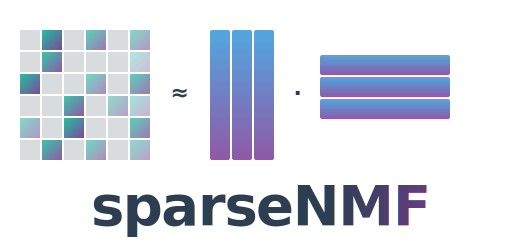

<p align="center">
  
</p>

<h1 align="center">sparseNMF</h1>

<p align="center">
  <em>GPU-accelerated sparse non-negative matrix factorization with PyTorch.</em>
</p>

<p align="center">
  <a href="https://github.com/bschilder/sparseNMF/actions/workflows/ci.yml"></a>
  <a href="https://github.com/bschilder/sparseNMF/actions/workflows/docker.yml"></a>
  <a href="https://sparsenmf.netlify.app/"></a>
  <a href="https://sparsenmf.netlify.app/"></a>
  <a href="https://github.com/bschilder/sparseNMF/releases"></a>
  <a href="https://github.com/bschilder/sparseNMF/pkgs/container/sparsenmf"></a>
  
  <a href="LICENSE"></a>
  <a href="https://github.com/astral-sh/ruff"></a>
</p>

<!--
  Note on badges while the repo is still private:
  - CI / Docker badges are GitHub-native and work for authenticated viewers.
  - Coverage badge: CI writes ``docs/_static/coverage.svg``; Netlify serves
    it publicly at ``sparsenmf.netlify.app/_static/coverage.svg`` so the
    badge resolves for anyone (raw.githubusercontent.com would 404 for
    anonymous viewers while the repo is private).
  - Docs badge: shields.io website check that pings the live Netlify URL —
    no Netlify site-ID required.
  - Other badges are static images so they work regardless of repo visibility.
  - When the repo goes public, swap the static "Releases" badge above for the
    dynamic ``img.shields.io/github/v/release/...`` shield that pulls actual version data.
  - The Docs site is built by ``.github/workflows/docs.yml`` and
    published to GitHub Pages at https://bschilder.github.io/sparseNMF/
    on every push to main. Uses sphinx_rtd_theme — byte-equivalent
    to the look of readthedocs.io. To enable Pages on this repo if
    not already on:
      1. Repo → Settings → Pages.
      2. Source: "GitHub Actions".
      3. First build runs on the next push to main (or trigger
         manually from the Actions tab → Docs → Run workflow).
    ``.readthedocs.yaml`` is kept around in case you ever want to
    move to RTD Business (required for hosted RTD on private repos).
-->

---

## Why this exists

Non-negative matrix factorization (NMF) is a workhorse for biomedical
data: it produces interpretable parts-based decompositions of count or
abundance matrices (gene-association, phenotype, single-cell, document-
term, …). Off-the-shelf NMF implementations either materialize a dense
copy of the input (memory-prohibitive for very sparse, high-dimensional
data — think 100k samples × 30k features at 0.5% density) or never
touch the GPU.

`sparseNMF` keeps the input on the device as a `torch.sparse` tensor,
processes it in mini-batches, and runs the multiplicative updates
end-to-end on CUDA. It also ships an optional **joint NMF +
autoencoder** model that learns the factorization and a low-dimensional
embedding in a single pass — useful when downstream tasks
(visualization, clustering, retrieval) want the latent code rather
than the W/H matrices directly.

A deeper survey of prior NMF implementations and where this package
sits among them lives in the docs:
[**Prior works** →](https://sparseNMF.readthedocs.io/en/latest/prior_works.html)

## Install

```bash
# from PyPI (when released)
pip install sparse-nmf

# from source
pip install git+https://github.com/bschilder/sparseNMF.git

# with viz extras
pip install "sparse-nmf[viz]"
```

GPU acceleration requires a PyTorch build with CUDA. CPU-only works for
correctness checks and small data.

## Quick start

### Standalone NMF

```python
from scipy.sparse import csr_matrix
from sparse_nmf import SparseNMF

X = csr_matrix(...)                                 # (n_samples, n_features)

nmf = SparseNMF(n_components=256, max_iter=500, device="cuda")
X_reduced = nmf.fit_transform(X)                    # → (n_samples, 256) dense
H = nmf.components_                                  # → (256, n_features) dense
```

### Joint NMF + autoencoder (recommended for downstream embeddings)

```python
from sparse_nmf import train_joint_model

z, model = train_joint_model(
    X,
    n_samples=X.shape[0],
    n_features=X.shape[1],
    nmf_components=256,
    latent_dim=2,
    device="cuda",
    n_epochs=100,
)
# z is (n_samples, 2) — drop into UMAP / scatterplot directly.
```

See [`examples/`](examples/) for runnable end-to-end scripts and the
[**API reference**](https://sparseNMF.readthedocs.io/en/latest/api.html)
for every public function.

## Sample data

The package bundles a small synthetic sparse matrix (rank-8 plus
noise, 500 × 1k, 5% density) for tests and quickstart:

```python
from sparse_nmf.data import load_synthetic_sparse, generate_synthetic_sparse

X = load_synthetic_sparse()
# or programmatically:
X = generate_synthetic_sparse(n_samples=10_000, n_features=5_000, n_components=16, seed=42)
```

## Container

Two flavors are published to GHCR on every push to `main` and every
`v*` tag — pick the one that matches your runtime:

| Tag | Base | Best for |
|---|---|---|
| `ghcr.io/bschilder/sparsenmf:latest` (alias of `:gpu-latest`) | `pytorch/pytorch:2.4.1-cuda12.4-cudnn9-runtime` | GPU hosts (CUDA 12.4 / cuDNN 9 already inside) |
| `ghcr.io/bschilder/sparsenmf:cpu-latest` | `python:3.11-slim` + CPU torch | CI / dev / hosts without a GPU |

```bash
# GPU host (default)
docker pull ghcr.io/bschilder/sparsenmf:latest
docker run --gpus all --rm -it ghcr.io/bschilder/sparsenmf:latest python

# CPU-only host
docker pull ghcr.io/bschilder/sparsenmf:cpu-latest
docker run --rm -it ghcr.io/bschilder/sparsenmf:cpu-latest python
```

Tagged variants follow `{gpu,cpu}-<version>` (e.g.
`ghcr.io/bschilder/sparsenmf:gpu-v0.1.0`) and `{gpu,cpu}-<sha>` for
exact reproducibility.

## Contributing

```bash
git clone https://github.com/bschilder/sparseNMF.git
cd sparseNMF
pip install -e ".[dev]"
pytest                       # tests + coverage
ruff check . && ruff format --check .
sphinx-build docs docs/_build/html
```

CI runs lint + types + tests + coverage on every PR. Releases are
tag-triggered (`v*`) and publish the wheel + Docker image
automatically.

## License

MIT — see [LICENSE](LICENSE).

## Citation

If `sparseNMF` is useful in published work, please cite:

```bibtex
@software{schilder_sparsenmf_2026,
  author = {Schilder, Brian},
  title  = {sparseNMF: GPU-accelerated sparse non-negative matrix factorization},
  url    = {https://github.com/bschilder/sparseNMF},
  year   = {2026},
}
```
