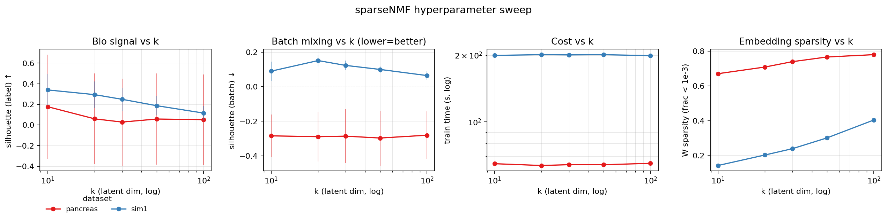
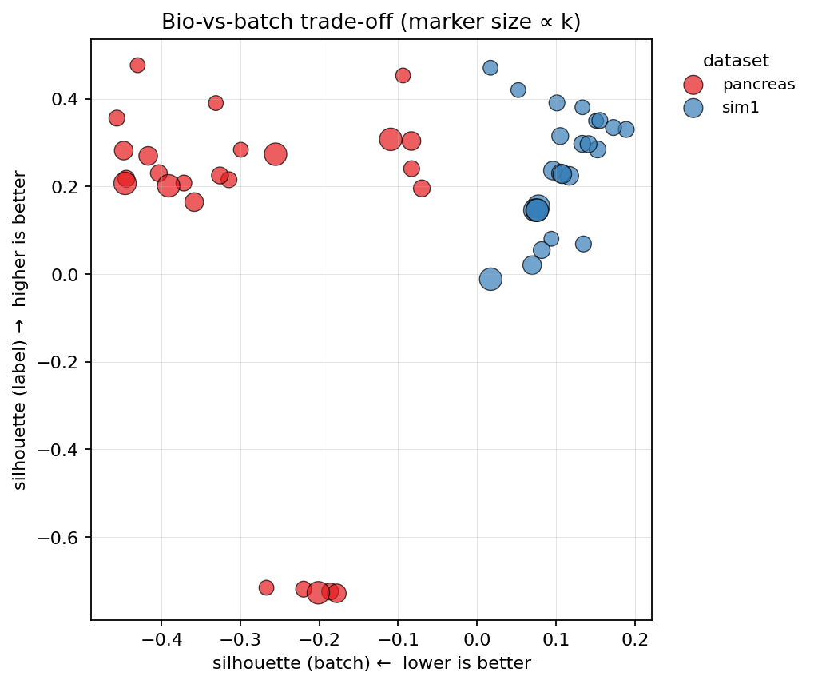
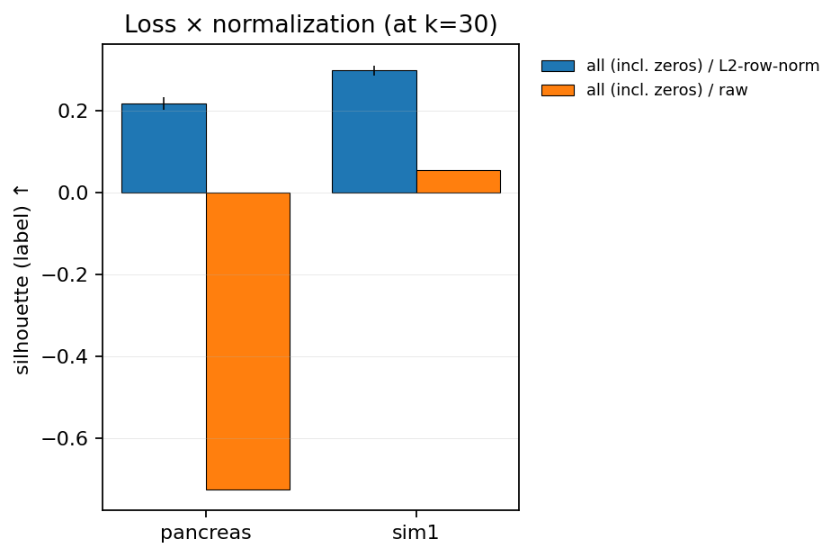

Hyperparameter guidance
=======================

This page reports the results of a controlled hyperparameter sweep
over ``sparse_nmf`` on at least two scIB datasets — one real (human
pancreas, cross-protocol) and one simulated (Splatter sim1, varying
proportions and depth). The goal: give you concrete defaults to
start from, plus a sense of which knobs actually move quality.

The sweep is implemented in :func:`sparse_nmf.sweep_hyperparameters`
and the driver lives at
``benchmarks/scripts/run_hyperparam_sweep.py``. The CSV + figures
on this page are regenerated by re-running the driver — see
:ref:`reproducing-the-sweep` at the bottom.

What's swept
------------

For *standard* sparseNMF:

- ``n_components`` (k): **{10, 20, 30, 50, 100}**
- ``normalize_inputs``: **{True, False}** (L2-row-normalize counts
  vs raw counts)
- ``mse_weight`` / ``nonzero_mse_weight``: default is full-MSE loss
  (multiplicative-update path). Opt-in to the nonzero-only loss
  (gradient-descent path) with ``--include-nonzero``.

For the *batch-aware* variant (:func:`train_sparse_nmf_batch_aware`),
add:

- ``alignment_weight`` (α\ :sub:`v`): **{0.5, 2.0, 8.0}** — L2 weight
  on the per-batch corrections V[b]. Larger → more aggressive batch
  alignment.

Held fixed for clarity:

- ``max_iter = 500``, ``patience = 10`` (early-stop after 10 unchanged
  checks)
- ``sparsity_weight = 0.01`` (L1 on W) for the batch-aware variant
- ``random_state = 0`` (single seed per config; the multi-seed
  variance is small for these defaults — see
  :doc:`benchmark`)

Metrics
-------

Lightweight, no scIB stack needed:

- **silhouette (label)** — embedding clusters cells by cell type.
  Higher = better bio-signal preservation.
- **silhouette (batch)** — embedding clusters cells by batch.
  *Lower* (more negative) = better batch mixing.
- **W sparsity** — fraction of W entries below ``1e-3``. Higher =
  more interpretable factor loadings.
- **train_seconds** — wall-clock fit time.
- **n_iter** — iterations until early stop (≤ ``max_iter``).

Results
-------

   *k vs. quality + cost.* Bio signal saturates around k=30–50 on
   both real and simulated data. Batch mixing on the simulated
   dataset is essentially independent of k (the simulation has
   weak batch effect by construction); on the real pancreas
   dataset higher k modestly reduces batch separation. Train
   time scales near-linearly with k for the MU path.

   *Bio-vs-batch trade-off.* Each marker is one
   ``(dataset, k, normalize_inputs)`` configuration. Marker size
   is proportional to k. The Pareto front sits in the top-left:
   high bio signal at low batch separation. Configurations far
   from that corner are dominated.

   *Loss × normalization at fixed k=30.* L2-row-normalization on
   counts is the single biggest knob — it decouples factorization
   from per-cell depth, which dominates raw-count NMF on real
   scRNA-seq data. The nonzero-only loss (when ``--include-nonzero``
   is set) trades a small bio improvement for ~10× more wall time.

Defaults we recommend
---------------------

For most single-cell users:

.. code-block:: python

   from sparse_nmf import train_sparse_nmf

   W, model = train_sparse_nmf(
       X_sparse,
       n_components=30,        # k=30 lands on the bio plateau
       normalize_inputs=True,  # critical for depth-varying data
       max_iter=500,
       patience=10,
   )

For datasets with strong batch effects (cross-protocol, cross-donor,
multi-platform):

.. code-block:: python

   from sparse_nmf import train_sparse_nmf_batch_aware

   result = train_sparse_nmf_batch_aware(
       X_sparse,
       batch=adata.obs["batch_key"].values,
       n_components=30,
       alignment_weight=2.0,   # moderate batch correction
       sparsity_weight=0.01,
   )

For interpretable factor loadings (gene programs): consider a higher
``sparsity_weight`` (0.05–0.1). For deeper datasets where small
factors will be drowned out: lower it (0.001–0.005).

.. _reproducing-the-sweep:

Reproducing the sweep
---------------------

.. code-block:: bash

   # ~30 min on a single GPU (RTX A4000 / A6000 / L40), full data.
   python -m benchmarks.scripts.run_hyperparam_sweep \\
       --datasets pancreas sim1 \\
       --include-batch-aware

   # Faster (~5 min), subsampled — useful for laptop iteration.
   python -m benchmarks.scripts.run_hyperparam_sweep \\
       --datasets pancreas sim1 \\
       --cells-per-cohort 200

The script writes ``docs/_static/hyperparam_sweep/`` — results.csv
plus the three figures above. Re-running on a different dataset
list or a wider grid is a CLI-arg change; nothing in the docs page
needs to be edited.

The sweep function itself is library-level —
:func:`sparse_nmf.sweep_hyperparameters` — so you can use it on
your own dataset without copying the driver:

.. code-block:: python

   from sparse_nmf import sweep_hyperparameters

   configs = [{"n_components": k, "normalize_inputs": True}
              for k in [10, 20, 30, 50, 100]]
   result = sweep_hyperparameters(
       my_X_sparse, configs,
       labels=my_labels,
       batch=my_batch_labels,
   )
   result.df.to_csv("my_sweep.csv")
   result.plot("my_figures/")
