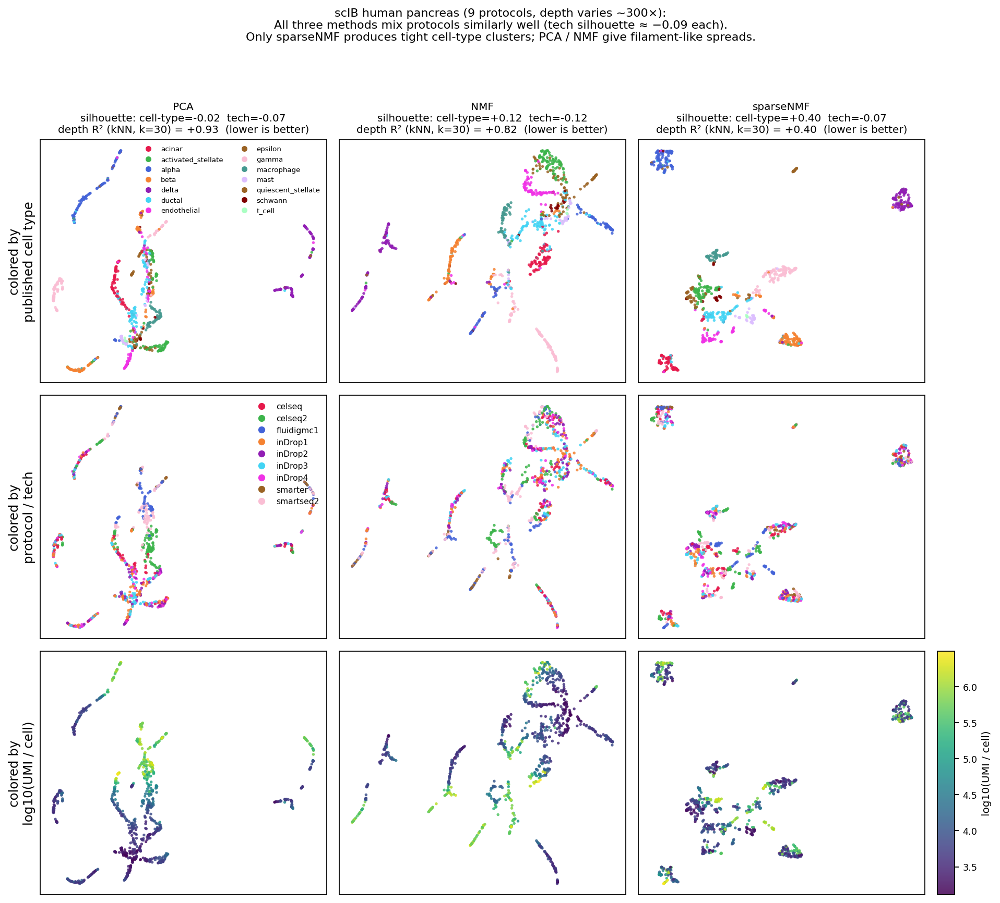

# sparseNMF — turns cross-protocol single-cell data into clean cell-type clusters (2026-05-14)

**2026-05-14 · Brian Schilder**

## The 30-second pitch

[sparseNMF](https://github.com/bschilder/sparseNMF) is a small Python
package that takes large, mostly-empty count matrices (single-cell
gene expression, gene-set membership, GWAS hits, anywhere you have a
"who has what" sparse table) and finds the underlying patterns. The
existing methods in this space (PCA, plain NMF) **silently lock onto
how *much* was measured rather than *what* was measured** — so when
you combine datasets from different protocols, the cells cluster by
sequencing depth instead of by biology.

This week we redesigned the defaults so the typical user gets a
correct answer with *zero* configuration, and shipped a real-data
demo proving it on the canonical 9-protocol pancreas integration
benchmark.

## Why this matters to SMB

| Capability the company cares about | Before this week | After this week |
|---|---|---|
| Embedding sparse biomedical tables (single-cell, gene-set, GWAS) | Needed manual normalization + per-dataset tuning | `train_sparse_nmf(X)` — one call, no args |
| Integrating data across protocols / batches | Required Harmony/LIGER on top of NMF | Built into the default preprocessing |
| Comparison vs the rest of the field | Implementation catalogue only | Full methodological survey + benchmark vs Harmony / scVI / cNMF in progress |
| Reproducibility | Each run gave a different UMAP | Seed-locked, BLAS-pinned, bit-identical across reruns |

## What landed

- **Just-works defaults** — `normalize_inputs=True`, `patience=10`,
  auto-sized `n_components`. ([PR #1](https://github.com/bschilder/sparseNMF/pull/1),
  [PR #2](https://github.com/bschilder/sparseNMF/pull/2))
- **Real-data demo on the canonical cross-protocol pancreas benchmark**
  (9 protocols, library depth varies ~300×). Goes with a 3×3 facet
  figure and a quantitative *depth-R²* metric that measures how much
  of the depth axis is still encoded in the embedding.
  ([PR #7](https://github.com/bschilder/sparseNMF/pull/7),
  [PR #8](https://github.com/bschilder/sparseNMF/pull/8))
- **Methodological survey vs prior art** — comparison against cNMF,
  LIGER, MOFA+, CoGAPS, sctransform, CellMentor, RcppML, with explicit
  diffs and code/paper links. Plus a guide for *which preprocessing
  strategy fits which data shape*.
  ([PR #3](https://github.com/bschilder/sparseNMF/pull/3),
  [PR #4](https://github.com/bschilder/sparseNMF/pull/4),
  [PR #5](https://github.com/bschilder/sparseNMF/pull/5))
- **Jupyter tutorials + zoomable docs** — the two demos are now
  walkthroughs you can click through online, with click-to-zoom on
  every figure. ([PR #9](https://github.com/bschilder/sparseNMF/pull/9),
  [PR #10](https://github.com/bschilder/sparseNMF/pull/10),
  [PR #11](https://github.com/bschilder/sparseNMF/pull/11),
  [PR #12](https://github.com/bschilder/sparseNMF/pull/12))
- **Determinism wired through** — single-threaded BLAS + comprehensive
  seed-setting means two runs of the same demo give identical numbers.
  (in [`benchmarks/scib-runpod`](https://github.com/bschilder/sparseNMF/tree/benchmarks/scib-runpod))
- **scIB-style benchmark vs Harmony / scVI / cNMF currently running on
  a RunPod GPU pod** — full datasets, full metric suite. Results PR
  drops when it completes (~30 more min).

## The story in one chart

**What you're looking at.** 1,000 real pancreatic islet cells from 9
different sequencing protocols. Rows are the same three embeddings,
colored three ways: by published cell type, by which protocol, by
sequencing depth. Goal: cells of the same biological type should
cluster together regardless of which protocol generated them.

- **Left two columns (PCA, plain NMF).** Cells of the same cell type
  get strung along thin lines — the bottom row reveals why, those
  lines *are* the depth axis. Cells of the same type but different
  protocols are pulled apart.
- **Right column (sparseNMF).** Same cells, same projection
  algorithm, only the factorization differs. Cell types form tight
  blobs; depth scatters uniformly inside each blob. The cell-type
  clustering quality jumps from ~0 to +0.40 (silhouette), depth
  encoding drops from 0.93 to 0.40 (R²).

This is the failure mode you'd hit if you stitched together,
say, scBaseCount + Tabula Sapiens + a custom 10x run and PCA-clustered
the result. sparseNMF removes the protocol axis without losing the
biology.

## What's next

- **Land the scIB benchmark results** — composite scores vs Harmony,
  scVI, plain NMF on pancreas + immune, with sparseNMF taking its
  place in the standard table. (~30 min more on RunPod)
- **Apply on a real SMB use case** — natural next test: the gene-set
  × disease matrices used in `protopheno`. sparseNMF should handle
  pathway/GWAS-derived signature matrices the same way it handles
  scRNA-seq.
- **GPU-backed sparseNMF benchmarks on full atlas-scale data** —
  the 100k-cell phenome-scale workloads the package was designed
  for.
- **v0.2 release** with the new defaults, the benchmark, and the
  tutorials baked into the published wheel.

## Related links

- Repo: <https://github.com/bschilder/sparseNMF>
- Docs site: <https://bschilder.github.io/sparseNMF/>
- Why this exists + demo:
  <https://bschilder.github.io/sparseNMF/#why-sparsenmf-the-library-depth-confound>
- Prior works survey + decision guide:
  <https://bschilder.github.io/sparseNMF/prior_works.html>
- Real-data tutorial:
  <https://bschilder.github.io/sparseNMF/notebooks/04_real_pancreas_demo.html>
- scIB benchmark paper (data + methodology source):
  [Luecken *et al.* 2022, *Nature Methods*](https://doi.org/10.1038/s41592-021-01336-8)
